<!-- ══════════════════════════════════════════════════════════════════ -->
<!--          MAYAN KAMBOJ — GitHub Profile README                    -->
<!-- ══════════════════════════════════════════════════════════════════ -->

<!-- ╔══════════════════════════════════════════════════════════════╗  -->
<!--  HERO                                                            -->
<!-- ╚══════════════════════════════════════════════════════════════╝  -->

<div align="center">

<!-- Animated wave header (capsule-render) -->


</div>

<!-- ─── Animated hero card (custom SVG: particles · gradient name · underline) ─── -->
<div align="center">
  
</div>

<br/>

<!-- ─── Animated typing tagline (readme-typing-svg by DenverCoder9) ─── -->
<div align="center">
  <a href="https://git.io/typing-svg">
    
  </a>
</div>

<br/>

<!-- ─── Profile views · Social badges ─── -->
<div align="center">


&nbsp;
[](https://github.com/kambojmayan-png)
&nbsp;
[](https://sentinel-ivory-two-76.vercel.app/)
&nbsp;
[](https://chaukas.vercel.app)

</div>

<br/>

---

<!-- ╔══════════════════════════════════════════════════════════════╗  -->
<!--  TERMINAL / WHOAMI                                               -->
<!-- ╚══════════════════════════════════════════════════════════════╝  -->

<div align="center">
  
</div>

<br/>

---

<!-- ╔══════════════════════════════════════════════════════════════╗  -->
<!--  ABOUT ME                                                        -->
<!-- ╚══════════════════════════════════════════════════════════════╝  -->

## `// ABOUT ME`

```text
▸  B.E. CSE student · specialising in AI & ML
▸  Building real software projects — from AI security tools to civic-tech hackathon apps
▸  Practising DSA consistently with Java & C++ on LeetCode
▸  Exploring Python for AI/ML pipelines, CLI tooling, and backend APIs
▸  Working with TypeScript/Next.js for full-stack web development
▸  Interested in agentic AI, security, and building things that actually solve real problems
```

<br/>

---

<!-- ╔══════════════════════════════════════════════════════════════╗  -->
<!--  CURRENTLY LEARNING                                              -->
<!-- ╚══════════════════════════════════════════════════════════════╝  -->

## `// CURRENTLY LEARNING`

<div align="center">

<table>
<tr>
<td valign="top" width="50%">

**🤖 &nbsp; AI & Machine Learning**
- Agentic AI systems and safety
- Prompt injection & security patterns
- NLP and pattern detection
- FastAPI for ML backends

**🧩 &nbsp; Data Structures & Algorithms**
- LeetCode — Strings, Hash Tables
- Two Pointers, Sliding Window
- Stack, Recursion, DFS/BFS

**🐍 &nbsp; Python**
- CLI tooling & scripting
- FastAPI + REST APIs
- Offline, dependency-free modules

</td>
<td valign="top" width="50%">

**🌐 &nbsp; TypeScript / Next.js**
- Server-side rendering (SSR/RSC)
- Playwright E2E & layout testing
- Type-safe architecture

**📘 &nbsp; Java**
- OOP principles & design patterns
- LeetCode problem solving
- Software engineering foundations

**🔒 &nbsp; Security**
- AI agent threat modelling
- Supply-chain attack patterns
- OWASP Agentic Top 10

</td>
</tr>
</table>

</div>

<br/>

---

<!-- ╔══════════════════════════════════════════════════════════════╗  -->
<!--  LANGUAGES                                                       -->
<!-- ╚══════════════════════════════════════════════════════════════╝  -->

## `// LANGUAGES I USE`

<div align="center">

<table>
  <tr>
    <td align="center" width="105">
      <br/>
      <sub><b>Python</b></sub><br/>
      <sub><code>AI · CLI · Scripts</code></sub>
    </td>
    <td align="center" width="105">
      <br/>
      <sub><b>TypeScript</b></sub><br/>
      <sub><code>Web · Next.js</code></sub>
    </td>
    <td align="center" width="105">
      <br/>
      <sub><b>Java</b></sub><br/>
      <sub><code>OOP · DSA</code></sub>
    </td>
    <td align="center" width="105">
      <br/>
      <sub><b>C++</b></sub><br/>
      <sub><code>DSA · Algorithms</code></sub>
    </td>
    <td align="center" width="105">
      <br/>
      <sub><b>JavaScript</b></sub><br/>
      <sub><code>Web · UI</code></sub>
    </td>
    <td align="center" width="105">
      <br/>
      <sub><b>HTML / CSS</b></sub><br/>
      <sub><code>Markup · Styles</code></sub>
    </td>
  </tr>
</table>

</div>

<br/>

---

<!-- ╔══════════════════════════════════════════════════════════════╗  -->
<!--  TECH STACK                                                      -->
<!-- ╚══════════════════════════════════════════════════════════════╝  -->

## `// TECH STACK`

<div align="center">

<table>
<tr>
<td align="center" valign="top" width="33%">

**Frameworks & Runtimes**


</td>
<td align="center" valign="top" width="33%">

**AI & Data**


</td>
<td align="center" valign="top" width="33%">

**Tools & Platforms**


</td>
</tr>
</table>

</div>

<br/>

---

<!-- ╔══════════════════════════════════════════════════════════════╗  -->
<!--  GITHUB ACTIVITY                                                 -->
<!-- ╚══════════════════════════════════════════════════════════════╝  -->

## `// GITHUB ACTIVITY`

<div align="center">

<picture>
  <source media="(prefers-color-scheme: dark)"  srcset="https://github-readme-stats.vercel.app/api?username=kambojmayan-png&show_icons=true&theme=github_dark&hide_border=true&bg_color=0d1117&title_color=58a6ff&icon_color=79c0ff&text_color=8b949e&ring_color=58a6ff&count_private=true"/>
  <source media="(prefers-color-scheme: light)" srcset="https://github-readme-stats.vercel.app/api?username=kambojmayan-png&show_icons=true&theme=default&hide_border=true"/>
  
</picture>
&nbsp;
<picture>
  <source media="(prefers-color-scheme: dark)"  srcset="https://github-readme-stats.vercel.app/api/top-langs/?username=kambojmayan-png&layout=compact&theme=github_dark&hide_border=true&bg_color=0d1117&title_color=58a6ff&text_color=8b949e&langs_count=6"/>
  <source media="(prefers-color-scheme: light)" srcset="https://github-readme-stats.vercel.app/api/top-langs/?username=kambojmayan-png&layout=compact&theme=default&hide_border=true&langs_count=6"/>
  
</picture>

<br/><br/>

<picture>
  <source media="(prefers-color-scheme: dark)"  srcset="https://streak-stats.demolab.com?user=kambojmayan-png&theme=github-dark-blue&hide_border=true&background=0d1117&ring=58a6ff&fire=bc8cff&currStreakLabel=58a6ff&sideLabels=8b949e"/>
  <source media="(prefers-color-scheme: light)" srcset="https://streak-stats.demolab.com?user=kambojmayan-png&theme=default&hide_border=true"/>
  
</picture>

<br/><br/>

<picture>
  <source media="(prefers-color-scheme: dark)"  srcset="https://github-readme-activity-graph.vercel.app/graph?username=kambojmayan-png&theme=github-compact&bg_color=0d1117&color=58a6ff&line=58a6ff&point=bc8cff&hide_border=true&area=true&area_color=58a6ff"/>
  <source media="(prefers-color-scheme: light)" srcset="https://github-readme-activity-graph.vercel.app/graph?username=kambojmayan-png&theme=minimal&hide_border=true"/>
  
</picture>

</div>

<br/>

---

<!-- ╔══════════════════════════════════════════════════════════════╗  -->
<!--  TROPHIES                                                        -->
<!-- ╚══════════════════════════════════════════════════════════════╝  -->

## `// TROPHIES`

<div align="center">

<picture>
  <source media="(prefers-color-scheme: dark)"  srcset="https://github-profile-trophy.vercel.app/?username=kambojmayan-png&theme=darkhub&no-frame=true&no-bg=true&margin-w=8&column=6"/>
  <source media="(prefers-color-scheme: light)" srcset="https://github-profile-trophy.vercel.app/?username=kambojmayan-png&theme=flat&no-frame=true&no-bg=true&margin-w=8&column=6"/>
  
</picture>

</div>

<br/>

---

<!-- ╔══════════════════════════════════════════════════════════════╗  -->
<!--  FEATURED PROJECTS                                               -->
<!-- ╚══════════════════════════════════════════════════════════════╝  -->

## `// FEATURED PROJECTS`

<br/>

<!-- ─── Repo pin cards (dynamic, from GitHub API) ─── -->
<div align="center">

<a href="https://github.com/kambojmayan-png/SENTINEL">
  <picture>
    <source media="(prefers-color-scheme: dark)"  srcset="https://github-readme-stats.vercel.app/api/pin/?username=kambojmayan-png&repo=SENTINEL&theme=github_dark&hide_border=true&bg_color=0d1117&title_color=58a6ff&text_color=8b949e&icon_color=79c0ff"/>
    <source media="(prefers-color-scheme: light)" srcset="https://github-readme-stats.vercel.app/api/pin/?username=kambojmayan-png&repo=SENTINEL&theme=default&hide_border=true"/>
    
  </picture>
</a>
&nbsp;
<a href="https://github.com/kambojmayan-png/chaukas">
  <picture>
    <source media="(prefers-color-scheme: dark)"  srcset="https://github-readme-stats.vercel.app/api/pin/?username=kambojmayan-png&repo=chaukas&theme=github_dark&hide_border=true&bg_color=0d1117&title_color=bc8cff&text_color=8b949e&icon_color=d2a8ff"/>
    <source media="(prefers-color-scheme: light)" srcset="https://github-readme-stats.vercel.app/api/pin/?username=kambojmayan-png&repo=chaukas&theme=default&hide_border=true"/>
    
  </picture>
</a>

</div>

<br/>

<!-- ─── SENTINEL Detail Card ─── -->
<details open>
<summary><b>🛡️ &nbsp; SENTINEL — AI Agent Security Scanner</b> &nbsp; <a href="https://sentinel-ivory-two-76.vercel.app/"></a> &nbsp; <a href="https://pypi.org/project/sentinel-md/"></a></summary>

<br/>

> *See what a file would make your AI coding agent do — before the agent reads it.*

AI coding agents treat repository config files as **orders**. Whoever edits `CLAUDE.md`, `.cursorrules`, or `.mcp.json` controls what the agent does — with **your** terminal, credentials, and codebase.

Sentinel reads those files first and tells you, in plain English, what each one would make the agent do.

| Feature | Detail |
|:---|:---|
| 🔍 **Static scanner** | 26 deterministic offline rules, 0 external calls |
| 🚪 **Gate mode** | Refuses to start an agent in a compromised project |
| 🔄 **Time-Warp sandbox** | Catches dormant sleeper attacks that activate only in later sessions |
| 💬 **PR check** | Plain-English behavioural diff comment on every pull request |
| 🩺 **Instruction Doctor** | Trims agent instruction tokens without changing behaviour |
| 🌐 **Web app + API** | Paste or drop a file, get a verdict in milliseconds |
| 🖥️ **VS Code extension** | Underlines dangerous lines as you save |

```bash
pip install sentinel-md
sentinel scan .          # scan the current project
sentinel run -- claude   # start agent only if project is clean
```

**Stack:** `Python` `FastAPI` `HTML/CSS/JS` `GitHub Actions` `PyPI` `Vercel`

[](https://github.com/kambojmayan-png/SENTINEL/actions) &nbsp; [](https://github.com/kambojmayan-png/SENTINEL/blob/main/docs/compliance/OWASP_AGENTIC_TOP10.md) &nbsp; [](https://github.com/kambojmayan-png/SENTINEL/blob/main/LICENSE)

</details>

<br/>

<!-- ─── chaukas Detail Card ─── -->
<details open>
<summary><b>🔔 &nbsp; चौकस / CHAUKAS — UPI Fraud Fire-Drill App</b> &nbsp; <a href="https://chaukas.vercel.app"></a> &nbsp; </summary>

<br/>

> *A scam fire-drill your parents can actually use. Built in one day.*

Most UPI fraud victims aren't hacked — under fear and time pressure they send the money themselves. Chaukas lets people **rehearse the moment** before it happens in real life.

| Feature | Detail |
|:---|:---|
| 📞 **Scam simulations** | 3 real scenarios: QR scam, electricity OTP scam, digital arrest |
| 🗣️ **Hindi-first** | Guide voice explains every screen — built for elders, not developers |
| 📊 **Knowledge-Behaviour Gap** | Measures who knows the rule and still falls for it under pressure |
| 🔍 **/check page** | Paste any suspicious message, hear verdict + highlighted pressure tactics |
| 🏗️ **JSON scenario engine** | Adding a new scam type takes ~20 minutes |
| ✅ **Playwright tests** | Layout tested at 320/360/412px on real browser |

**Stack:** `Next.js 16` `TypeScript` `Playwright` `Vercel`

[](https://github.com/kambojmayan-png/chaukas/actions/workflows/test.yml) &nbsp; [](https://chaukas.vercel.app) &nbsp; [](https://github.com/kambojmayan-png/chaukas/blob/main/LICENSE)

</details>

<br/>

<!-- ─── AEGIS pin card ─── -->
<div align="center">

<a href="https://github.com/kambojmayan-png/AEGIS-GLOBAL-NEWS">
  <picture>
    <source media="(prefers-color-scheme: dark)"  srcset="https://github-readme-stats.vercel.app/api/pin/?username=kambojmayan-png&repo=AEGIS-GLOBAL-NEWS&theme=github_dark&hide_border=true&bg_color=0d1117&title_color=3fb950&text_color=8b949e&icon_color=56d364"/>
    <source media="(prefers-color-scheme: light)" srcset="https://github-readme-stats.vercel.app/api/pin/?username=kambojmayan-png&repo=AEGIS-GLOBAL-NEWS&theme=default&hide_border=true"/>
    
  </picture>
</a>

</div>

<br/>

---

<!-- ╔══════════════════════════════════════════════════════════════╗  -->
<!--  DSA & PROBLEM SOLVING                                           -->
<!-- ╚══════════════════════════════════════════════════════════════╝  -->

## `// DSA & PROBLEM SOLVING`

<div align="center">

Solving LeetCode problems consistently in **Java** and **C++**.

</div>

<br/>

<div align="center">

| Topic | Problems worked on |
|:---|:---|
| **String** | Longest Substring Without Repeating, Valid Palindrome, Group Anagrams, Permutation in String, Roman to Integer |
| **Hash Table** | Two Sum, Group Anagrams, Valid Anagram, Contains Duplicate |
| **Two Pointers** | Valid Palindrome, Reverse String, Reverse Words |
| **Sliding Window** | Longest Substring Without Repeating, Permutation in String |
| **Stack** | Valid Parentheses |
| **Math** | FizzBuzz, Find Index of First Occurrence |

</div>

<br/>

<div align="center">

[](https://github.com/kambojmayan-png/Leetcode)

</div>

<br/>

---

<!-- ╔══════════════════════════════════════════════════════════════╗  -->
<!--  CURRENT FOCUS (animated progress bars)                         -->
<!-- ╚══════════════════════════════════════════════════════════════╝  -->

## `// CURRENT FOCUS`

<div align="center">
  
</div>

<br/>

---

<!-- ╔══════════════════════════════════════════════════════════════╗  -->
<!--  JOURNEY                                                         -->
<!-- ╚══════════════════════════════════════════════════════════════╝  -->

## `// JOURNEY SO FAR`

<div align="center">

```
   ╭─────────────────────────────────────────────────────╮
   │                                                     │
   │   01  CSE Enrollment                                │
   │         ↓                                           │
   │   02  Python · Java · C++ · First programs          │
   │         ↓                                           │
   │   03  Data Structures & Algorithms (LeetCode)       │
   │         ↓                                           │
   │   04  TypeScript · Next.js · Full-stack web         │
   │         ↓                                           │
   │   05  AI / ML Specialisation                        │
   │         ↓                                           │
   │   06  Real Projects — SENTINEL · chaukas · AEGIS    │
   │         ↓                                           │
   │  ▶▶  Still here. Still building.                   │
   │                                                     │
   ╰─────────────────────────────────────────────────────╯
```

</div>

<br/>

---

<!-- ╔══════════════════════════════════════════════════════════════╗  -->
<!--  CONNECT                                                         -->
<!-- ╚══════════════════════════════════════════════════════════════╝  -->

## `// CONNECT`

<div align="center">

<a href="https://github.com/kambojmayan-png">
  
</a>
&nbsp;&nbsp;
<a href="https://sentinel-ivory-two-76.vercel.app/">
  
</a>
&nbsp;&nbsp;
<a href="https://chaukas.vercel.app">
  
</a>

<br/><br/>

<samp>Open to collaborating on AI/ML projects, security tools, and civic tech.</samp>

</div>

<br/>

---

<!-- ╔══════════════════════════════════════════════════════════════╗  -->
<!--  FOOTER                                                          -->
<!-- ╚══════════════════════════════════════════════════════════════╝  -->

<div align="center">
  
</div>

<!-- Animated wave footer (capsule-render) -->

