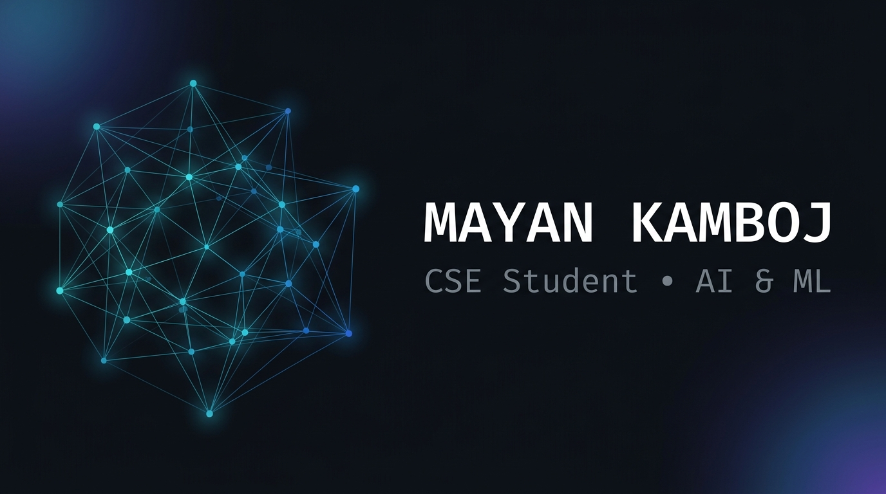

<div align="center">

<!-- ═══════════════════════════════════════════════════════════ -->
<!--                        HERO BANNER                        -->
<!-- ═══════════════════════════════════════════════════════════ -->



<br/>

<!-- ─── ANIMATED TAGLINE ─── -->


<br/>

<!-- ─── ONE-LINE INTRO ─── -->
<p>
  <samp>B.E. CSE student specialising in AI &amp; ML — building real tools with Python, TypeScript, Java &amp; C++.</samp>
</p>

<br/>

<!-- ─── SOCIAL LINKS ─── -->
<a href="https://github.com/kambojmayan-png">
  
</a>

</div>

<br/>

---

<!-- ═══════════════════════════════════════════════════════════ -->
<!--                     TERMINAL / WHOAMI                     -->
<!-- ═══════════════════════════════════════════════════════════ -->

<div align="center">
  
</div>

<br/>

---

## `// ABOUT ME`

```text
▸  B.E. CSE student · specialising in AI & ML
▸  Building real software projects — from security tools to civic-tech apps
▸  Practising DSA with Java & C++ on LeetCode
▸  Exploring Python for AI/ML, scripting, and CLI tooling
▸  Working with TypeScript/Next.js for full-stack development
▸  Interested in agentic AI, security, and building things that actually work
```

<br/>

---

## `// CURRENTLY LEARNING`

<div align="center">

| Area | What I am doing |
|:---|:---|
| 🤖 **AI / ML** | Exploring agentic AI, security scanning, and NLP patterns |
| 🧩 **DSA** | Solving LeetCode problems — Strings, Hash Tables, Two Pointers, Sliding Window |
| 🐍 **Python** | CLI tools, FastAPI, offline scanners, scripting |
| 📘 **Java** | OOP concepts, software engineering, LeetCode |
| ⚡ **C++** | Problem solving, algorithmic foundations |
| 🌐 **TypeScript / Next.js** | Full-stack web apps, SSR, Playwright testing |
| 🔒 **Security** | AI agent security, prompt injection, supply-chain attacks |
| 🛠️ **Dev Tools** | Git, GitHub Actions, CI/CD, VS Code extensions |

</div>

<br/>

---

## `// LANGUAGES I USE`

<div align="center">

<table>
  <tr>
    <td align="center" width="110">
      <br/>
      <sub><b>Python</b></sub><br/>
      <sub><i>AI · CLI · Scripts</i></sub>
    </td>
    <td align="center" width="110">
      <br/>
      <sub><b>TypeScript</b></sub><br/>
      <sub><i>Web · Next.js</i></sub>
    </td>
    <td align="center" width="110">
      <br/>
      <sub><b>Java</b></sub><br/>
      <sub><i>OOP · DSA</i></sub>
    </td>
    <td align="center" width="110">
      <br/>
      <sub><b>C++</b></sub><br/>
      <sub><i>DSA · Algorithms</i></sub>
    </td>
    <td align="center" width="110">
      <br/>
      <sub><b>JavaScript</b></sub><br/>
      <sub><i>Web · UI</i></sub>
    </td>
    <td align="center" width="110">
      <br/>
      <sub><b>HTML/CSS</b></sub><br/>
      <sub><i>Markup · Styling</i></sub>
    </td>
  </tr>
</table>

</div>

<br/>

---

## `// TECH STACK`

<div align="center">

**FRAMEWORKS & RUNTIMES**


&nbsp;&nbsp;

&nbsp;&nbsp;

&nbsp;&nbsp;


<br/><br/>

**AI / ML & DATA**


&nbsp;&nbsp;

&nbsp;&nbsp;


<br/><br/>

**TOOLS & PLATFORMS**


&nbsp;&nbsp;

&nbsp;&nbsp;

&nbsp;&nbsp;


</div>

<br/>

---

## `// GITHUB ACTIVITY`

<div align="center">

<picture>
  <source media="(prefers-color-scheme: dark)"  srcset="https://github-readme-stats.vercel.app/api?username=kambojmayan-png&show_icons=true&theme=github_dark&hide_border=true&bg_color=0d1117&title_color=58a6ff&icon_color=79c0ff&text_color=8b949e&ring_color=58a6ff"/>
  <source media="(prefers-color-scheme: light)" srcset="https://github-readme-stats.vercel.app/api?username=kambojmayan-png&show_icons=true&theme=default&hide_border=true"/>
  
</picture>
&nbsp;&nbsp;
<picture>
  <source media="(prefers-color-scheme: dark)"  srcset="https://github-readme-stats.vercel.app/api/top-langs/?username=kambojmayan-png&layout=compact&theme=github_dark&hide_border=true&bg_color=0d1117&title_color=58a6ff&text_color=8b949e&langs_count=6"/>
  <source media="(prefers-color-scheme: light)" srcset="https://github-readme-stats.vercel.app/api/top-langs/?username=kambojmayan-png&layout=compact&theme=default&hide_border=true&langs_count=6"/>
  
</picture>

<br/><br/>

<picture>
  <source media="(prefers-color-scheme: dark)"  srcset="https://github-readme-activity-graph.vercel.app/graph?username=kambojmayan-png&theme=github-compact&bg_color=0d1117&color=58a6ff&line=58a6ff&point=79c0ff&hide_border=true"/>
  <source media="(prefers-color-scheme: light)" srcset="https://github-readme-activity-graph.vercel.app/graph?username=kambojmayan-png&theme=minimal&hide_border=true"/>
  
</picture>

</div>

<br/>

---

## `// FEATURED PROJECTS`

<br/>

<table>
<tr>
<td width="100%" valign="top">

### 🛡️ SENTINEL — AI Agent Security Scanner

> *See what a file would make your AI coding agent do — before the agent reads it.*

AI coding agents like Claude Code, Cursor, and Gemini CLI treat ordinary files in your repository as **orders**. Whoever can edit those files can steer the agent — with your credentials, terminal, and codebase.

**Sentinel reads those files first** and tells you, in plain English, exactly what each one would make the agent do.

**What it does:**
- 🔍 Scans `CLAUDE.md`, `AGENTS.md`, `.cursorrules`, `.mcp.json`, VS Code tasks for 26 deterministic rule violations
- 🚪 **Gate mode** — refuses to start an agent if the project is compromised
- 🔄 **Time-Warp sandbox** — detects dormant sleeper attacks that activate only in later sessions
- 💬 **PR check** — posts plain-English behavioural diff comments on every pull request
- 🩺 **Instruction Doctor** — trims agent instruction tokens without changing behaviour
- 🔐 **AGENTS.lock** — CI-signed approval record; a PR cannot approve itself
- 🌐 **Web app + REST API** — paste or upload any file, get verdict in milliseconds
- 🖥️ **VS Code extension** — underlines dangerous lines as you save

```
pip install sentinel-md
sentinel scan .
```

**Stack:** `Python` `FastAPI` `HTML/CSS/JS` `GitHub Actions` `PyPI` `Vercel`

[](https://sentinel-ivory-two-76.vercel.app/)
&nbsp;
[](https://github.com/kambojmayan-png/SENTINEL)
&nbsp;
[](https://pypi.org/project/sentinel-md/)

</td>
</tr>
</table>

<br/>

<table>
<tr>
<td width="100%" valign="top">

### 🔔 चौकस / CHAUKAS — UPI Fraud Fire-Drill App

> *A scam fire-drill your parents can actually use.*

Built in **one day** for **HACKDAY 1.0** (DECODEP · *Tech for a Better Tomorrow* · 20 September 2026).

Most UPI fraud victims are not hacked — under fear and time pressure they send the money themselves. Chaukas lets people **rehearse the moment** before it happens in real life.

**What it does:**
- 📞 Simulates 3 real scam scenarios: fake buyer QR scam, electricity disconnection OTP scam, digital arrest
- 🗣️ Hindi-first with a guide voice — designed for elders, not developers
- 📊 Measures the **Knowledge-Behaviour Gap**: people who know the rule and still fall under pressure
- 🔍 `/check` — paste any suspicious message, hear a verdict, see pressure tactics highlighted
- 🏗️ Scenario engine driven by JSON graph files — adding a new scam takes ~20 minutes
- ✅ Playwright layout tests on real devices at 320/360/412px

**Stack:** `Next.js 16` `TypeScript` `Playwright` `Vercel`

[](https://chaukas.vercel.app)
&nbsp;
[](https://github.com/kambojmayan-png/chaukas)
&nbsp;
[](https://github.com/kambojmayan-png/chaukas/actions/workflows/test.yml)

</td>
</tr>
</table>

<br/>

<table>
<tr>
<td width="100%" valign="top">

### 📰 AEGIS GLOBAL NEWS — Next.js News Application

A full-stack news application built with **Next.js** — exploring server-side rendering, API integration, and modern web development patterns with TypeScript.

**Stack:** `Next.js` `TypeScript` `Vercel`

[](https://github.com/kambojmayan-png/AEGIS-GLOBAL-NEWS)

</td>
</tr>
</table>

<br/>

---

## `// DSA & PROBLEM SOLVING`

<div align="center">

Practising data structures and algorithms consistently using **Java** and **C++**.

</div>

<br/>

| Category | Problems worked on |
|:---|:---|
| **Strings** | Longest Substring Without Repeating, Valid Palindrome, Group Anagrams, Permutation in String |
| **Hash Tables** | Two Sum, Group Anagrams, Contains Duplicate |
| **Two Pointers** | Valid Palindrome, Reverse String |
| **Sliding Window** | Longest Substring, Permutation in String |
| **Math / Basics** | Roman to Integer, FizzBuzz, Reverse Words |
| **Stack** | Valid Parentheses |

<br/>

<div align="center">

[](https://github.com/kambojmayan-png/Leetcode)

</div>

<br/>

---

## `// CURRENT FOCUS`

```
  ┌─────────────────────────────────────────────┐
  │                                             │
  │   🤖  Agentic AI & Security                 │
  │                                             │
  │   🧩  Data Structures & Algorithms          │
  │                                             │
  │   🐍  Python — tools & backend              │
  │                                             │
  │   🌐  TypeScript / Next.js — full-stack     │
  │                                             │
  │   📘  Java — OOP & software engineering     │
  │                                             │
  └─────────────────────────────────────────────┘
```

<br/>

---

## `// JOURNEY SO FAR`

```
  CSE Enrollment
       ↓
  First Programs · Python · Java
       ↓
  Data Structures & Algorithms (LeetCode)
       ↓
  Web Development · Next.js · TypeScript
       ↓
  AI / ML Specialisation
       ↓
  Real Projects — SENTINEL · chaukas · AEGIS
       ↓
  ▶  Still here. Still building.
```

<br/>

---

## `// CONNECT`

<div align="center">

<a href="https://github.com/kambojmayan-png">
  
</a>

<br/><br/>

<samp>Open to collaborating on AI/ML projects, security tools, and civic tech.</samp>

</div>

<br/>

---

<div align="center">
  
</div>
