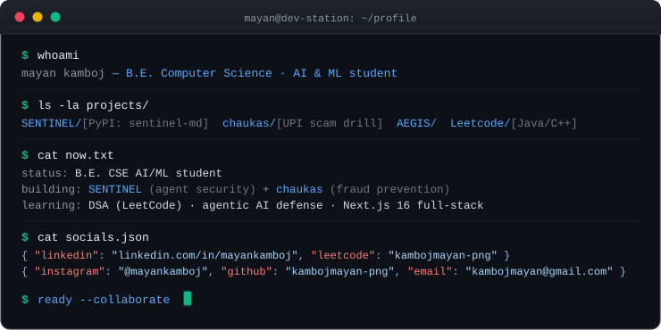

  

  

 

&nbsp;

&nbsp;

 

---

## About

I'm a second-year CSE student specialising in AI & ML. I write Python for tooling and backend work, TypeScript for web apps, and Java and C++ for algorithms. Most of what I learn, I learn by building things.

Right now I'm working on an AI agent security scanner, a fraud-prevention app I built at a hackathon, and grinding through LeetCode.

 

---

## Projects

 

### SENTINEL &nbsp;·&nbsp; [live demo](https://sentinel-ivory-two-76.vercel.app/) &nbsp;·&nbsp; [repo](https://github.com/kambojmayan-png/SENTINEL) &nbsp;·&nbsp; 

 

An offline security scanner for AI coding agent config files. AI agents like Claude Code, Cursor, and Gemini CLI treat repository files (`CLAUDE.md`, `AGENTS.md`, `.mcp.json`) as instructions — whoever edits those files controls what the agent does with your terminal and credentials. SENTINEL reads those files before the agent does and explains, in plain English, what each one would make the agent do.

Ships as a CLI, a VS Code extension, a GitHub Action, and a web app. Runs fully offline, no API key required. Published on PyPI as `sentinel-md`.

`Python` &nbsp; `FastAPI` &nbsp; `GitHub Actions` &nbsp; `PyPI` &nbsp; `Vercel`

  

### chaukas / चौकस &nbsp;·&nbsp; [live app](https://chaukas.vercel.app) &nbsp;·&nbsp; [repo](https://github.com/kambojmayan-png/chaukas)

 

A UPI fraud fire-drill app built at HACKDAY 1.0 in one day. Most UPI fraud victims aren't hacked — under fear and time pressure they send the money themselves. Chaukas simulates three real scam scenarios with Hindi voice guidance, designed for elders rather than developers.

 

| Home | Message, read aloud | The PIN moment |
|:---:|:---:|:---:|
|  |  |  |

 

`Next.js 16` &nbsp; `TypeScript` &nbsp; `Playwright` &nbsp; `Vercel`

  

### AEGIS Global News &nbsp;·&nbsp; [repo](https://github.com/kambojmayan-png/AEGIS-GLOBAL-NEWS)

A news application built with Next.js and TypeScript, exploring server-side rendering and API integration.

`Next.js` &nbsp; `TypeScript`

 

---

## Languages & tools

<table>
  <tr>
    <td align="center" width="80">
       
      Python
    </td>
    <td align="center" width="80">
       
      TypeScript
    </td>
    <td align="center" width="80">
       
      Java
    </td>
    <td align="center" width="80">
       
      C++
    </td>
    <td align="center" width="80">
       
      JavaScript
    </td>
    <td align="center" width="80">
       
      HTML/CSS
    </td>
    <td align="center" width="80">
       
      Next.js
    </td>
    <td align="center" width="80">
       
      FastAPI
    </td>
    <td align="center" width="80">
       
      Git
    </td>
  </tr>
</table>

 

---

## GitHub

&nbsp;

  

  

 

---

## DSA

Working through LeetCode consistently in Java and C++. Topics so far: strings, hash tables, two pointers, sliding window, stack, basic math.

→ [Solutions repo](https://github.com/kambojmayan-png/Leetcode)

 

---

## Terminal

  

 

---

  Open to collaborating on AI/ML, security tools, and civic tech.
   
  <a href="https://github.com/kambojmayan-png">github.com/kambojmayan-png</a>

 

  

